# ecommerce-microservices-docker-compose
E-commerce microservices platform deployed with Docker Compose on AWS EC2, featuring a React frontend, multiple backend services, polyglot databases, internal container networking, and persistent storage.

## 📂 Repo Layout

```text
.
├── Screenshots/
│   ├── architecture.png
│   ├── cartcontainer.png
│   ├── contactuscontainer.png
│   ├── contactuscontainerack.png
│   ├── dockerimages.png
│   ├── dockerps.png
│   ├── ecommercecontainer.png
│   └── inventorycontainer.png
│   └── login.png
│   └── orderplacedsucessfuly.png
│   └── productaddedcart.png
│   └── productcatalogcontainer.png
│   └── profilecontainer.png
│   └── shippingcontainer.png
│   └── signup.png
│   └── signupsuccessful.png
│   └── profile-management.png
└── README.md
└── docker-compose.yml


# 🛒 E-Commerce Microservices Platform (Docker Compose + AWS EC2)

## 📌 Overview

This repository contains a **production-style e-commerce microservices platform** deployed using **Docker Compose** on an **AWS EC2 instance (Ubuntu 22.04)**.

The project demonstrates real-world concepts such as:
- Microservices architecture
- Inter-container communication using Docker networking
- Polyglot persistence (MySQL, PostgreSQL, MongoDB)
- Persistent storage using Docker volumes
- Secure internal service communication
- Cloud deployment on AWS EC2

This project is designed to reflect **enterprise-grade deployment practices** and serves as a strong portfolio project for **DevOps, Cloud, and Backend Engineering roles**.

## Architecture Diagram

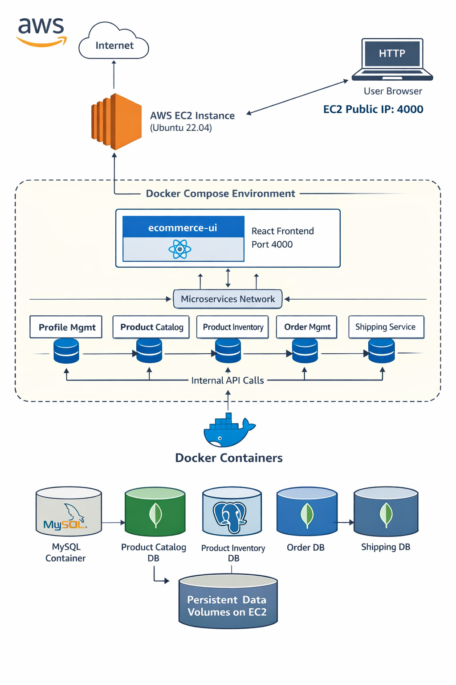

---

## 🧱 High-Level Architecture

The application follows a **microservices architecture**, where each service owns its own database and communicates over Docker’s internal network.

### Frontend
- **ecommerce-ui** (React)
- Exposed on port **4000**
- Communicates with backend services using internal Docker DNS

### Backend Services

| Service Name | Responsibility | Port |
|-------------|---------------|------|
| profile-management | User signup & authentication | 3003 |
| product-catalog | Product listing & details | 3001 |
| product-inventory | Inventory & stock management | 3002 |
| order-management | Order processing | 9090 |
| shipping-and-handling | Shipping workflow | 8080 |
| contact-support-team | Customer support | 8000 |

---

## 🗄 Database Architecture (Polyglot Persistence)

Each microservice owns a dedicated database, following **database-per-service** best practices.

| Service | Database Name | Database Type |
|-------|--------------|---------------|
| profile-management | profile_management | MySQL 8 |
| product-inventory | product_inventory | PostgreSQL |
| product-catalog | product_catalog | MongoDB |
| order-management | order_management | MongoDB |
| shipping-and-handling | shipping DB | MongoDB |
| contact-support-team | contact_support | MongoDB |

---

## 📦 Docker Volumes

Persistent storage is handled using Docker volumes to ensure data durability.

```
mongodb_product_catalog_data
mongodb_contact_support_data
mongodb_shipping_data
mongodb_order_management_data
mysql_profile_management_data
postgres_product_inventory_data
```

Volumes prevent data loss during container restarts or upgrades.

---

## 🔐 Security Model

- Internal service-to-service communication using Docker’s default bridge network
- Databases are **not publicly exposed**
- Only application ports are exposed on the EC2 instance
- Credentials are injected using environment variables
- No credentials are hardcoded inside images

This model closely resembles **VPC-style internal communication** used in production environments.

---

## 📌 Prerequisites

Instead of documenting installation steps that may change over time, this project references official documentation.

| Requirement | Link |
|------------|------|
| Docker | https://docs.docker.com/engine/install/ |
| Docker Compose | https://docs.docker.com/compose/install/ |
| Git | https://git-scm.com/downloads |
| AWS EC2 (Ubuntu 22.04) | https://docs.aws.amazon.com/ec2/ |

> ✅ **Tested on**: Ubuntu 22.04 LTS (AWS EC2)

---


## ☁ AWS Deployment Details

| Component | Configuration |
|---------|---------------|
| Instance Type | c7i-flex.large |
| Operating System | Ubuntu 22.04 LTS |
| Root Volume | 100 GB |
| Container Runtime | Docker |
| Orchestration | Docker Compose |

---

## 🚀 Deployment Steps (AWS EC2)

### Install Docker

```bash
sudo apt update
sudo apt install -y docker.io
sudo systemctl start docker
sudo systemctl enable docker
sudo usermod -aG docker ubuntu
```
Logout and login again to apply group changes.

### Install Docker Compose
```
sudo apt install -y docker-compose
```
### Verify Docker and Docker Compose Version
```
docker -v
docker-compose -v
```
### Clone the Repository

```
git clone https://github.com/vanuhanda/ecommerce-microservices-docker-compose.git
cd <commerce-microservices-docker-compose>
```
### Start the Application
```
docker compose up -d
```
Docker Compose will automatically:

Pull images from Docker Hub

Create networks and volumes

Start services in the correct dependency order

### Verify Running Containers
```
docker ps
```
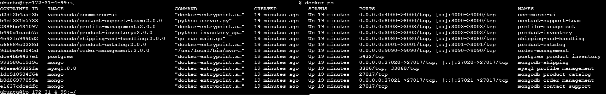
### Verify Pulled Images
```
docker images
```
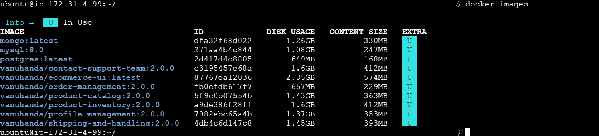
### Application Access
Replace <EC2_PUBLIC_IP:4000> with your instance’s public IP.
| Service                | URL                           |
| ---------------------- | ----------------------------- |
| Web UI                 | `http://<EC2_PUBLIC_IP>:4000` |
| Profile Management API | `http://<EC2_PUBLIC_IP>:3003` |
| Product Catalog API    | `http://<EC2_PUBLIC_IP>:3001` |
| Inventory API          | `http://<EC2_PUBLIC_IP>:3002` |
| Order Management API   | `http://<EC2_PUBLIC_IP>:9090` |
| Shipping API           | `http://<EC2_PUBLIC_IP>:8080` |

The remaining URL will only work if the ports are open in AWS EC2 security group. 

## 🧪 Key Concepts Demonstrated

- **Docker Compose orchestration**
- **Microservices networking via Docker DNS**
- **Stateful containers with persistent volumes**
- **Multi-database architecture**
- **Cloud deployment on AWS EC2**
- **End-to-end service dependency management**


📄 A detailed architecture explanation is available here:  


## 🐳 Docker Compose Configuration

The entire application stack is orchestrated using **Docker Compose**.

📄 Compose file location:  
➡️ [D:\GIT Repos\ecommerce-microservices-docker-compose\docker-compose.yml](docker-compose.yml)

```
version: "3"
services:
  ecommerce-ui:
    image:  vanuhanda/ecommerce-ui
    container_name: ecommerce-ui
    ports:
      - "4000:4000"
    environment:
      - REACT_APP_PROFILE_API_HOST=http://profile-management
      - REACT_APP_PRODUCT_API_HOST=http://product-catalog
      - REACT_APP_INVENTORY_API_HOST=http://product-inventory
      - REACT_APP_ORDER_API_HOST=http://order-management
      - REACT_APP_SHIPPING_API_HOST=http://shipping-and-handling
      - REACT_APP_CONTACT_API_HOST=http://contact-support-team
    depends_on:
      - profile-management
      - product-catalog
      - product-inventory
      - order-management
      - shipping-and-handling
      - contact-support-team
  contact-support-team:
    image: vanuhanda/contact-support-team:2.0.0
    container_name: contact-support-team
    ports:
      - "8000:8000"
    depends_on:
      - mongodb-contact-support
    environment:
      - MONGODB_HOST=mongodb-contact-support
      - MONGODB_PORT=27017
      - MONGODB_DATABASE=contact_support

  mongodb-contact-support: ## mongodb will use container port 27017
    image: mongo
    container_name: mongodb-contact-support
    volumes:
      - mongodb_contact_support_data:/data/db
  shipping-and-handling:
    image: vanuhanda/shipping-and-handling:2.0.0
    container_name: shipping-and-handling
    ports:
      - "8080:8080"
    depends_on:
      - mongodb-shipping
    environment:
      - MONGO_URI=mongodb://mongodb-shipping:27017

  mongodb-shipping: ## mongodb will use container port 27017
    image: mongo
    container_name: mongodb-shipping
    ports:
      - "27020:27017"
    volumes:
      - mongodb_shipping_data:/data/db
  product-catalog:
    image: vanuhanda/product-catalog:2.0.0
    container_name: product-catalog
    ports:
      - "3001:3001"
    depends_on:
      - mongodb-product-catalog
    environment:
      - MONGODB_HOST=mongodb-product-catalog
      - MONGODB_PORT=27017
      - MONGODB_DATABASE=product_catalog
  mongodb-product-catalog: ## mongodb will use container port 27017
    image: mongo
    container_name: mongodb-product-catalog
    volumes:
      - mongodb_product_catalog_data:/data/db
  order-management:
    image: vanuhanda/order-management:2.0.0
    container_name: order-management
    depends_on:
      - mongodb-order-management
    ports:
      - "9090:9090"
    environment:
      - PRODUCT_INVENTORY_API_HOST=http://product-inventory
      - PRODUCT_CATALOG_API_HOST=http://product-catalog
      - SHIPPING_HANDLING_API_HOST=http://shipping-and-handling
      - SPRING_DATA_MONGODB_URI=mongodb://mongodb-order-management:27017/order_management
  mongodb-order-management: ## mongodb will use container 27017
    image: mongo
    container_name: mongodb-order-management
    ports:
      - "27021:27017"
    volumes:
      - mongodb_order_management_data:/data/db
  product-inventory:
    image: vanuhanda/product-inventory:2.0.0
    container_name: product-inventory
    depends_on:
      - postgres_product_inventory
    ports:
      - "3002:3002"
    environment:
      - POSTGRES_HOST=postgres_product_inventory
      - POSTGRES_PORT=5432
      - POSTGRES_DB=product_inventory
      - POSTGRES_USER=inventory_user
      - POSTGRES_PASSWORD=inventory_password
  postgres_product_inventory: ## postgres will run on container port 5432
    image: postgres
    container_name: postgres_product_inventory
    environment:
      - POSTGRES_DB=product_inventory
      - POSTGRES_USER=inventory_user
      - POSTGRES_PASSWORD=inventory_password
    volumes:
      - postgres_product_inventory_data:/var/lib/postgresql
  profile-management:
    image: vanuhanda/profile-management:2.0.0
    container_name: profile-management
    ports:
      - "3003:3003"
    depends_on:
      - mysql_profile_management
    environment:
      - MYSQL_HOST=mysql_profile_management
      - MYSQL_PORT=3306
      - MYSQL_DATABASE=profile_management
      - MYSQL_USER=profile_user
      - MYSQL_PASSWORD=profile_password
  mysql_profile_management: ## will run on container 3306
    image: mysql:8.0
    container_name: mysql_profile_management
    environment:
      - MYSQL_DATABASE=profile_management
      - MYSQL_USER=profile_user
      - MYSQL_PASSWORD=profile_password
      - MYSQL_ROOT_PASSWORD=root_password
    volumes:
      - mysql_profile_management_data:/var/lib/mysql

volumes:
  mongodb_product_catalog_data:
  mongodb_contact_support_data:
  mongodb_shipping_data:
  mongodb_order_management_data:
  mysql_profile_management_data:
  postgres_product_inventory_data:
  ```

Key highlights:
- Single Docker network for inter-service communication
- Dedicated database per service
- Persistent volumes for all stateful services
- Environment-based service discovery
- Cloud-ready deployment model

---

## 🖥️ Application UI & Service Screenshots

The following screenshots demonstrate each running service and its functionality.

### 🛒 Login Page

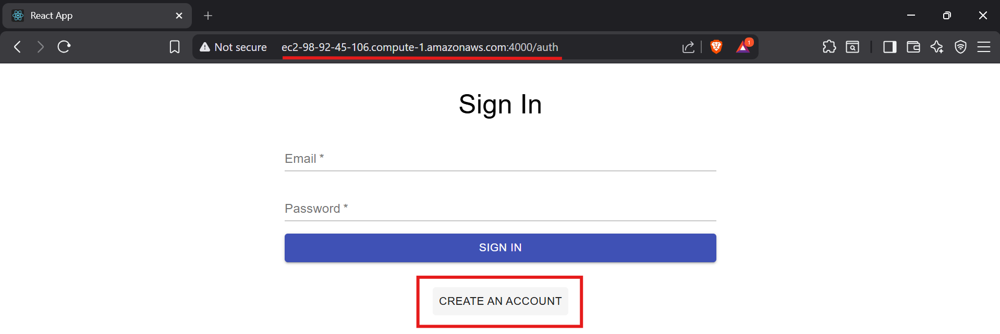

### 🛒 Signup/Create Account

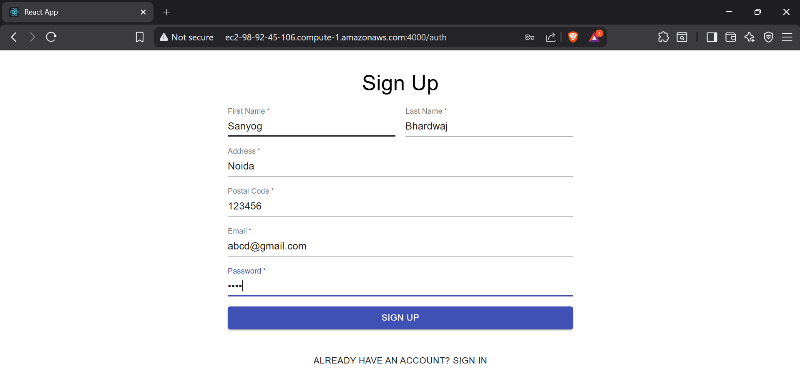

### 🛒 Signup Successfull


### 🛒 E-Commerce UI Microservice

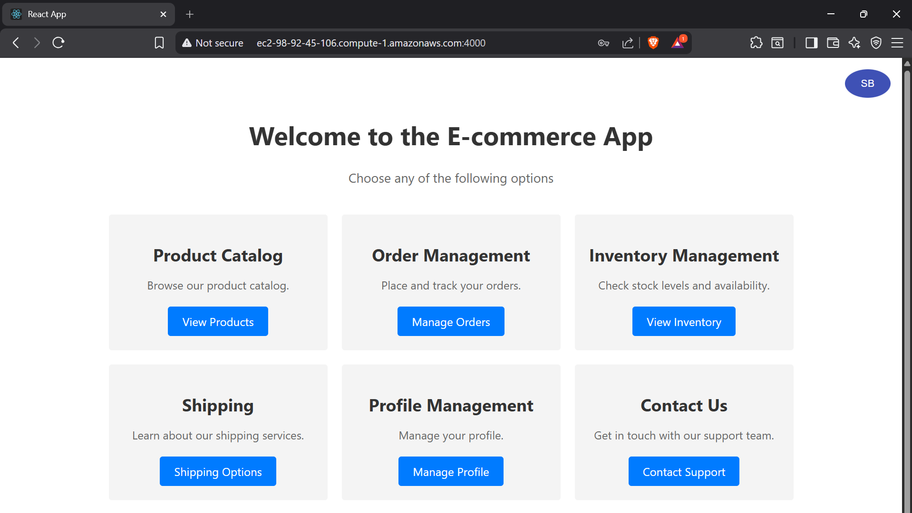

### 📦 Product Catalog Microservice

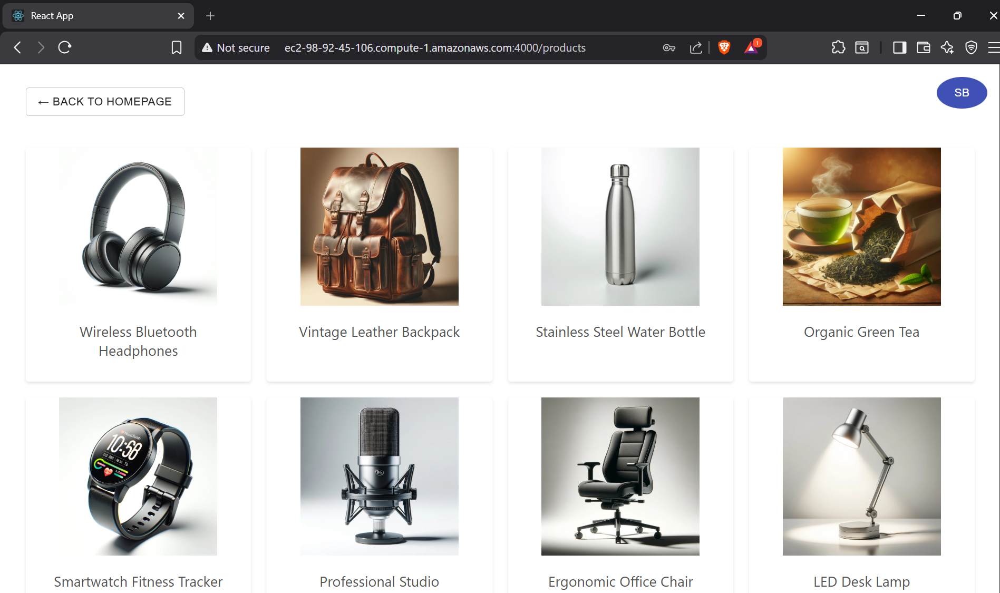

### 🚚 Shipping & Handling Microservice

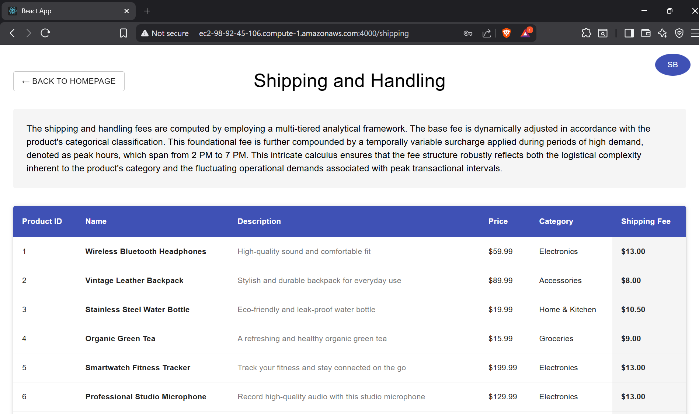

### 👤 Profile Management Microservice

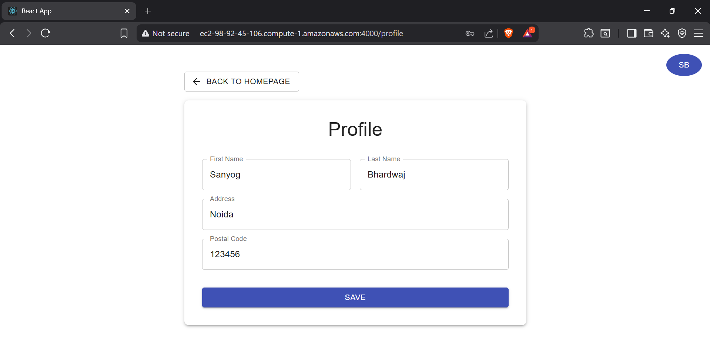

### ☎️ Contact Support Service
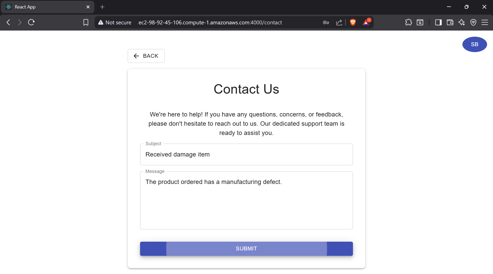


### 📊 Product Inventory Microservice
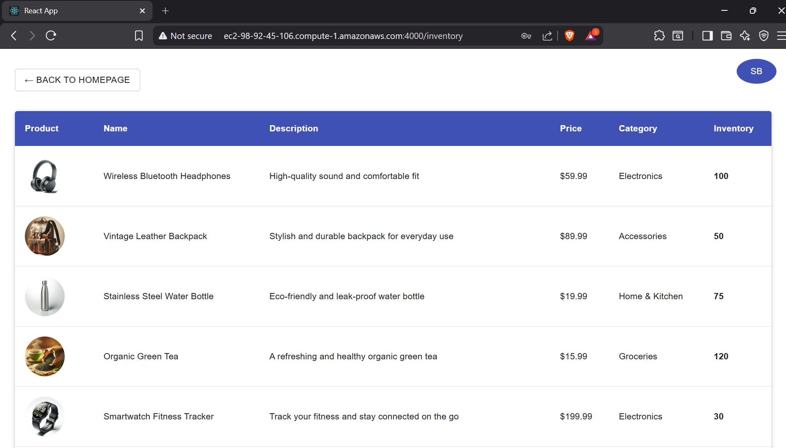

Go to Product Catalog and try adding any product.

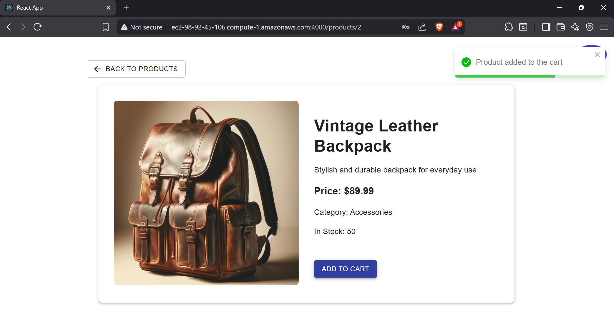

### 🧾 Order Management Service

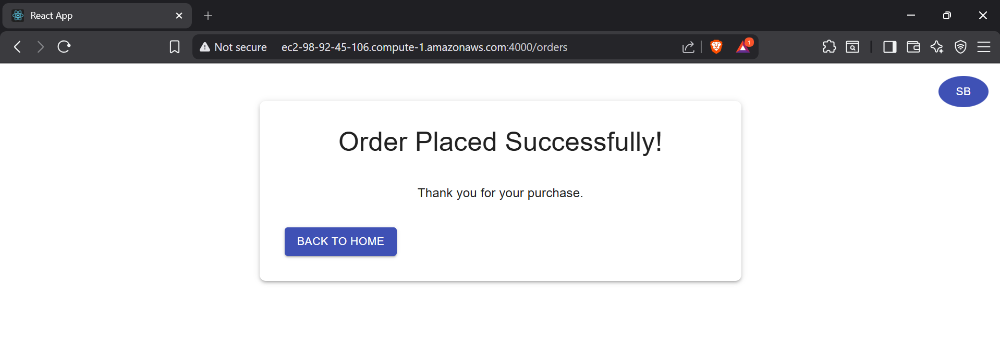

📁 All screenshots are stored under the `Screenshots/` directory.


